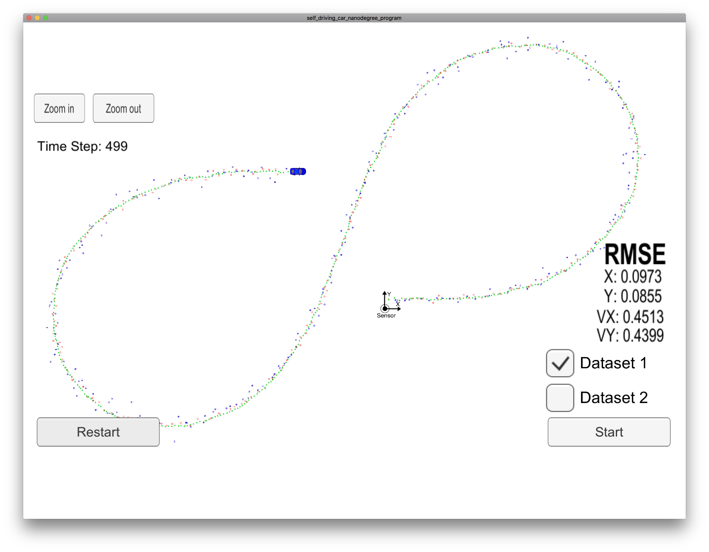
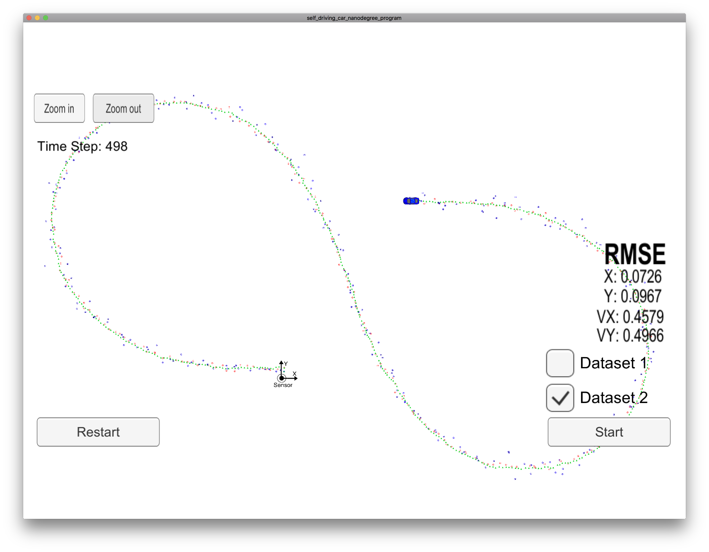

# Extended Kalman Filter Project - Gaspard Shen
In this project, I implement the Extended Kalman Filter to estimate the position and velocity of a moving car with lidar and radar measurements. In the end, I get the px, py, vx and vy RMSE values **[.009, .008, .45, .43]** for the Dataset 1 and **[.007, .009, .045, .049]** for Dataset 2 which pass the criteria in the project rubric.

## Implementation
1. Initialization
  - At first, we need to initialize the Kalman Filter covariance matrix P, transition matrix F and the H for LADAR in the function `FusionEKF::FusionEKF()` of `FusionEKF.cpp`.
  - Second, initialize the state vector for each LADRA and RADAR first measurements. For the LADAR cases, we simply assign the measurement result px and py to x_. At the RADAR cases, we need to covert the radar from polar to cartesian coordinates by calculating based on Trigonometry. Those was done in the function `FusionEKF::ProcessMeasurement()` of `FusionEKF.cpp`.
2. Prediction
  - Next part is the `Predict()`. We need calculate the noise covariance Q matrix based the timestamp difference. Here a trick that due the current simulator won't actually reinitialize when hitting the restart or switching Dataset, so I add an reinitialize process when the _dt_ is too big or small. Without need to restart the `./ExtendedKF`.
3. Update
  - Then is the `Update()` part according to the LADAR or RADAR measurement. Since the covariance matrix was different for LADAR and RADRA, here we assign the corresponding R and matrix. For RADAR cases, we use Extended Kalman Filter, h(x') need to calculate based on Jacobian matrix which in the `Tools::CalculateJacobian()` of `tools.cpp`. Recap that need to aware the _divide by zero_ cases.
  - Kalman Filter was based on the lesson we learn in the class. And the Extend Kalman Filter we need to apply the radar measurement h(x'). And remember to normalizing the resulting angle phi to add 2π or subtract 2π.
4. Evaluate
  - Last but no least, finish the `Tools::CalculateRMSE()` function in the `tools.cpp` and we can start evaluate our algorithm accuracy.

## Results
Here are the result of Dataset 1 and Dataset 2, both of it can pass the project criteria [.11, .11, 0.52, 0.52].

Dataset 1 RMSE: [.009, .008, .45, .43]


Dataset 2 RMSE: [.007, .009, .045, .049]


## Debug Tips
During work on this project, my program will hit the below error at runtime at beginning.
I try to add lots of debug message at every stage of the process, but it was way to inefficiency. Since I have many debug experience of C/C++, I decide like to use the **GDB**. And it was not that simple at latest MacOS high sierra.

```
Assertion `a_lhs.cols() == a_rhs.rows() && "invalid matrix product"
```

After searching lots of related article the codesign didn't work for me. In the end, I find out the easiest way to debug C/C++ is using **LLDB** instead of GDB at the MacOS. If you don't want to set up the IDE environments. Below is the instruction to use LLDB debugger. If you are familiar with CLI debugger, you can reference this [link](https://developer.apple.com/library/content/documentation/General/Conceptual/lldb-guide/chapters/A3-GDB-Summary.html#//apple_ref/doc/uid/TP40016717-CH4-DontLinkElementID_29) to know how to use LLDB from GDB experience.

After the LLDB setup, I instantly find out one of the matrix was declared as wrong type to vector. Really help me to speed up and finish this project.

 - Make a debug build

```
mkdir debug
cmake -DCMAKE_BUILD_TYPE=Debug ..
make
```

- Launch the LLDB, set breakpoint and run the debug

```
$ lldb ExtendedKF
(lldb) b kalman_filter.cpp:83
Breakpoint 1: where = ExtendedKF`KalmanFilter::UpdateEKF(Eigen::Matrix<double, -1, 1, 0, -1, 1> const&) + 850 at kalman_filter.cpp:83, address = 0x000000010003f6b2
(lldb) r
Process 14201 launched: '/Users/gaspards/Developer/udacity/CarND-Extended-Kalman-Filter-Project/debug/ExtendedKF' (x86_64)
Listening to port 4567
Connected!!!
EKF:
Process 14201 stopped
```
